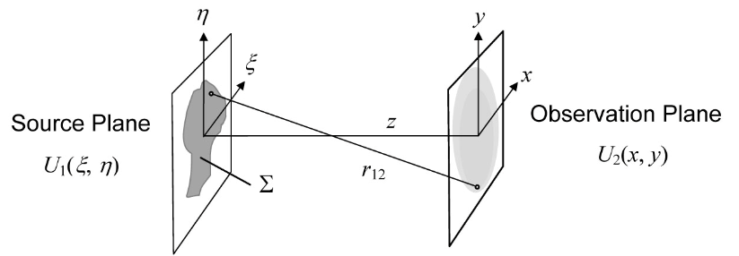
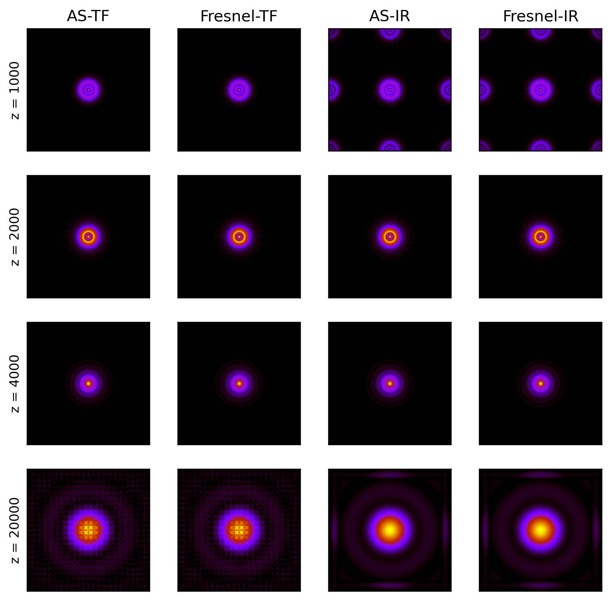
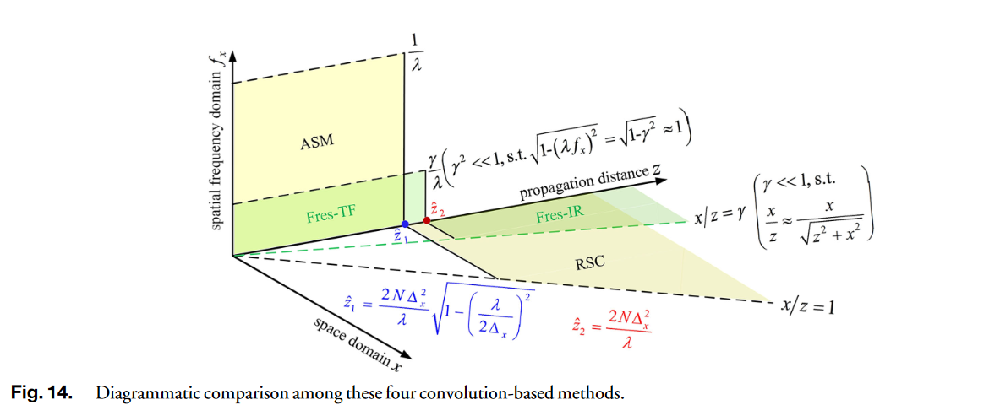

# 标量衍射计算不完全指南（python 实现）
## Introduction
本文的目的总结一些标量衍射的计算方法，并讨论讨论他们的适用条件。代码和例子在：github.com/sleepingcat

需要的预备知识：涉及的数理知识并不高深，主要是线性系统和傅里叶变换（离散傅里叶变换）的基础知识，当然还有光学。

涉及的内容：准确地说，应该是讨论基于快速傅里叶变换（FFT）的标量衍射，主要是常见的几种衍射计算方法
* 瑞利-索末菲/角谱衍射
* 菲涅尔衍射(Fres-TF 和 Fres-IR)


其他衍射计算方法（待补充）
* 单步菲涅尔衍射
* 两步菲涅尔衍射
* 夫琅禾费衍射
* 其他（未来补充）

本文的重点并不在标量衍射的推导，所以跳过麦克斯韦方程组，和参考文献[<a href="#ref2">2</a>] 类似，直接到跳到第一类瑞利-索末菲积分
$$
U_2(x, y)=\frac{1}{j \lambda} \iint_{\Sigma} U_1(\xi, \eta) \frac{z}{r_{12}} \frac{\exp \left(j k r_{12}\right)}{r_{12}} d \xi d \eta
$$
$\lambda$ 表示波长，$k=2\pi$ $(x, y)$ 和 $(\xi, \eta)$ 分别是入射屏面和观察平面的 坐标，$U_1$ 和 $U_2$ 分别是入射面和出射面的复振幅分布。
$\Sigma$ 为衍射孔径， $z$ 是两个平面的距离，$ r_{12}=\sqrt{z^2+(x-\xi)^2+(y-\eta)^2} $。



当然，我们可以直接计算这个积分。假设采样数为 $N\times N$，这个积分的计算复杂度为$ \mathcal{O}(N^4）$。而基于 FFT 的算法时间复杂度可以降到 $ \mathcal{O}(N^2\log{N}) $，假如 $ N=1024 $ 时，基于 FFT 算法需要的时间是 1分钟，那么积分方法可能要算上一整天。接下来进入正题。


## 瑞利-索末菲/角谱衍射
积分公式可以改写成卷积的形式
$$
U_2(x, y)=\iint U_1(\xi, \eta) h(x-\xi, y-\eta) d \xi d \eta,
$$
其中 
$$
h(x, y)=\frac{z}{j \lambda} \frac{\exp (j k r)}{r^2}
$$
为 R-S 积分的冲击响应（impulse response）

可以证明 R-S 积分传递函数（transfer function）的函数为
$$
H\left(f_X, f_Y\right)=\exp \left(j k z \sqrt{1-\left(\lambda f_X\right)^2-\left(\lambda f_Y\right)^2}\right)
$$
$f_X$, $f_Y$ 分别是$X$， $Y$方向的空间频率。这个函数即熟知的角谱（Angular Spectrum）传递函数。显然， $h(x, y)$ 和 $H(f_X, f_Y)$ 是傅里叶变换对。不过，两者之间的关系证明没有那么明显，证明过程可以参考[<a href="#ref2">3</a>]。

这样，就有两种方法去计算：第一种是基于冲击响应的卷积方法
$$
U_2(x, y)=\mathfrak{I}^{-1}\left\{\mathfrak{I}\left\{U_1(x, y)\right\} \mathfrak{F}\{h(x, y)\}\right\}
$$
另一种是基于传递函数的方法
$$
U_2(x, y)=\mathfrak{F}^{-1}\left\{\mathfrak{F}\left\{U_1(x, y)\right\} H\left(f_X, f_Y\right)\right\}
$$
$\mathfrak{F}$ 和 $\mathfrak{F}^{-1}$ 为傅里叶变换和逆傅里叶变换。这两种方法在数学上是等价的，但实际计算中，对光场进行离散采样，采样的频率是有限的，应用 FFT 计算的时候就会遇到问题。

### 瑞利-索末菲衍射的条件
#### 冲激响应的采样条件
假设对光场的离散采样如下图所示，$X$, $Y$ 的长度分别是 $L_X$,  $L_Y$，范围为$\left[ -\frac{1}{2}L_X, \frac{1}{2}L_X\right]$  $\left[ -\frac{1}{2}L_Y, \frac{1}{2}L_Y\right]$，采样间隔为$\Delta x$ 和 $\Delta y$，采样数 $N_x = \frac{L_X}{\Delta x}$，$N_y = \frac{L_y}{\Delta y}$。后续的讨论遵循这里的采样设置。


为了简化讨论，考虑一维的情形，对于 
$$h(x)=\frac{z}{j \lambda} \frac{\exp (j k r)}{r^2} = \frac{z}{j \lambda} \frac{\exp (j \phi_h(x))}{r^2}  $$
其中
$$
\phi_h = k \sqrt{z^2+x^2}
$$
其局域空间频率应小于奈奎斯特采样频率
$$ 
\left| \frac{1}{2 \pi} \frac{\partial \phi_h}{\partial x}  \right|_{max} \leq \frac{1}{2 \Delta x}
$$
即
$$
\left| \frac{x}{\lambda\sqrt{z^2 + x^2}}\right|_{max} \leq \frac{1}{2 \Delta x}
$$
整理得到
$$
z \geq \frac{ 2x_{max}\Delta x}{\lambda} \sqrt{1- \left(\frac{\lambda}{2\Delta x}\right)^2} 
$$
$x$ 的最大值为 $x_{max} = \frac{L}{2}$，且$L_X = N_x \Delta x$ 上式可以改为
$$
z \geq \frac{ L_X \Delta x}{\lambda} \sqrt{1- \left(\frac{\lambda}{2\Delta x}\right)^2} = \frac{ N_x \Delta x^2}{\lambda} \sqrt{1- \left(\frac{\lambda}{2\Delta x}\right)^2}
$$

上式并不适合衍射距离确定的采样讨论，当距离一定，整理上式得到采样间隔 $\Delta x$ 应该满足的条件
$$
\Delta x \leq \frac{\lambda z}{ L} \sqrt{1+ \left( \frac{L}{2z}\right)^2}
$$


#### 角谱衍射函数的采样条件 
$$
H\left(f_X\right)=\exp \left(j k z \sqrt{1-\left(\lambda f_X\right)^2}\right) = \exp \left(j \phi_H(f_X)\right)
$$
其中 $ \phi_H(f_X) =  k z \sqrt{1-\left(\lambda f_X\right)^2}$ 应该满足以下采样条件
$$
\left|\frac{1}{2 \pi} \frac{\partial \phi_H\left(f_X\right)}{\partial f_X}\right|_{\max } \leq \frac{1}{2 \Delta f_X},
$$
得到
$$
\left|\frac{z \lambda f_X}{\sqrt{1 - \left( \lambda f_X\right)^2}} \right|_{\max } \leq \frac{1}{2 \Delta f_X},
$$
式子左边是增函数，当 $f_X$ 取得最大值时，${f_X}_{max} = \frac{1}{2 \Delta x}$，$\Delta f_X = \frac{1}{L}$，代入上式得到采样条件
$$
z \leq \frac{ 2x_{max}\Delta x}{\lambda} \sqrt{1- \left(\frac{\lambda}{2\Delta x}\right)^2} 
$$

刚好与冲激响应函数相反，同样在衍射距离 $z$ 确定的情况下，可以得到采样间隔隔 $\Delta x$ 应该满足的条件
$$
\Delta x \geq \frac{\lambda z}{ L} \sqrt{1+ \left( \frac{L}{2z}\right)^2}
$$


## 傍轴近似：菲涅尔衍射
再次回到 R-S 积分
$$
U_2(x, y)=\frac{1}{j \lambda} \iint_{\Sigma} U_1(\xi, \eta) \frac{z}{r_{12}} \frac{\exp \left(j k r_{12}\right)}{r_{12}} d \xi d \eta
$$

在旁轴近似条件, 衍射角很小， $z \gg L$，倾斜因子 $K(\theta) = \frac{z}{r_{12}} \approx 1 $，对$r_{12}$进行泰勒展开

$$ r_{12}=\sqrt{z^2+(x-\xi)^2+(y-\eta)^2} \approx z\left[1+\frac{1}{2}\left(\frac{x-\xi}{z}\right)^2+\frac{1}{2}\left(\frac{y-\eta}{z}\right)^2\right] $$

最后得到菲涅尔衍射的冲激响应
$$
h(x, y) = \frac{1}{j\lambda z}\exp(jkz) \exp(\left[\frac{jk}{2z}\left(x^2+y^2\right)\right]
$$
传递函数，也就是上式的里叶变换
$$
H(f_{X},f_{Y}) =\exp(j k z)\exp\left[ -j\pi\lambda z\left( {f_X}^2 + {f_Y}^2\right)\right]
$$

其采样条件可以利用上一节得到的结果在傍轴近似下得到，对于冲激响应 h，当 $z \gg L$
$$
\Delta x \leq \frac{\lambda z}{ L} \sqrt{1+ \left( \frac{L}{2z}\right)^2} \approx \frac{\lambda z}{ L}
$$

传播距离 $z$ 应满足
$$
z \geq \frac{ L_X \Delta x}{\lambda}
$$

对于传递函数 H
$$
\Delta x \geq \frac{\lambda z}{ L}
$$

$$
z \leq \frac{ L_X \Delta x}{\lambda}
$$

## 代码实现和计算实例

仿真参数设置下图代码段所示，可以计算出在 $z=2000$ mm 处，两者采均满足采样条件，$z >2000$ mm ，则利用传递函数计算会产生偏差，反之，冲激响应函数方法会产生误差。

``` python
import numpy as np 
from scalardifflib import propagation_tf, propagation_ir
from mathfunc import circ
from matplotlib import pyplot as plt

# unit mm
L = 0.5                                 # length Lx 
Nx = 256                                # sample numbers
dx = L/Nx                               # sample interval delta x
wavelen = 0.5e-6                        # wavelength
r = 0.05                                # radius of the circle aperture 

x = np.linspace(-L/2, L/2-L/Nx, Nx)
x, y = np.meshgrid(x, x)
u1 = circ((x**2+y**2)/r**2)


kernels = ['AS', 'Fresnel' ] 
methods = ['TF', 'IR']
z = [1000,2000,4000,20000]

print(' zc = ',str(L*dx/wavelen), 'mm')

propagationfunc = lambda kernel, method, z: propagation_tf(u1, L, wavelen,z,kernel) if method =='TF' else propagation_ir(u1, L, wavelen,z,kernel)  
plt.figure(figsize=(8, 8), dpi=300)
figindx = 1
for i in range(len(z)):
    for j in range(len(kernels)):
        for k in range(len(methods)):
            u2 = propagationfunc(kernels[k], methods[j], z[i])
            plt.subplot(4,4,figindx)
            plt.imshow(np.abs(u2)**2, 'gnuplot')
            if (figindx-1) % 4 ==0 :
                plt.ylabel('z = '+str(z[i]))
            if figindx <= 4 :
                plt.title(kernels[k]+'-'+methods[j])
            plt.xticks([])
            plt.yticks([])
            figindx = figindx+1
```


## 总结
借用文献的一张图，这四种衍射计算方法的使用范围


## 参考文献/推荐阅读

1. <p name = "ref1">Goodman, Joseph W. Introduction to Fourier optics. Roberts and Company publishers, 2005.</p>
2. <p name = "ref2">Voelz, David George. Computational fourier optics: a MATLAB tutorial. Vol. 534. Bellingham, Washington: SPIE press, 2011.</p>
3. <p name = "ref2">Ersoy, Okan K. Diffraction, Fourier optics and imaging. John Wiley & Sons, 2006..</p>
4. <p name = "ref2">Zhang, Wenhui, et al. "Analysis of numerical diffraction calculation methods: from the perspective of phase space optics and the sampling theorem." JOSA A 37.11 (2020): 1748-1766.</p>

